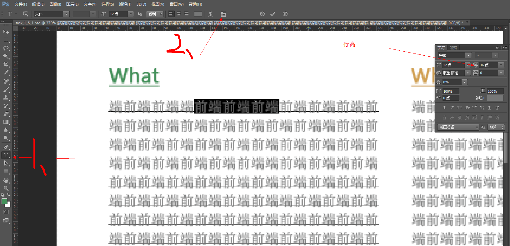
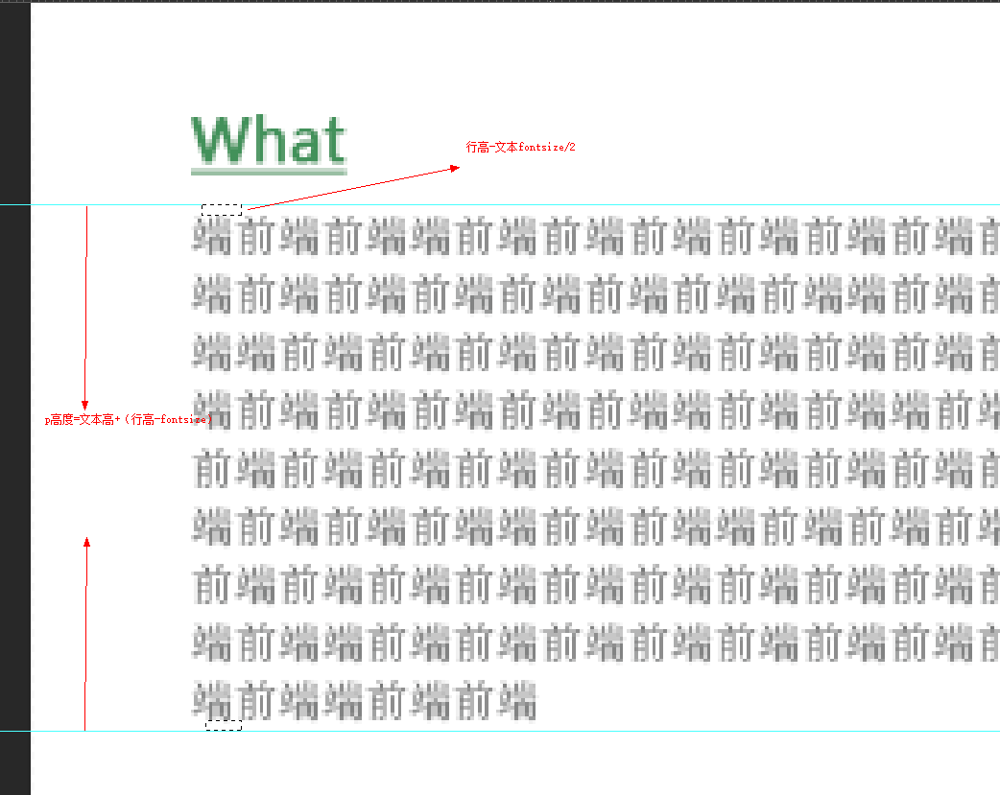

* 浮动设置
  * #banner区域布局，把需要浮动的元素放到不浮动的元素前面。让它先浮动。再设置不浮动的元素，这样不浮动的元素依然在文档流中。浮动元素和不浮动元素就处于同一个水平位置了。这种方式可以参考任务03的浮动布局。
* 字体设置
  * 文本大小跟以下设置有关
   * fontsize有关，
     * 通过ps的文本划线查看大小，而不是通过查看文本的高度决定的。
   * 字体有关。
     * 有的字体比较胖，看起来字就比较大。
* 段落文本行高
  * 行高确定参考
  * 段落因为有行高的关系，所以，要确定整个p标签的高度，必须把行高考虑在内。
    整个p的高度是文本的高度+(一个行高-文本fontsize，就是把文本高度上下补齐了。)
    